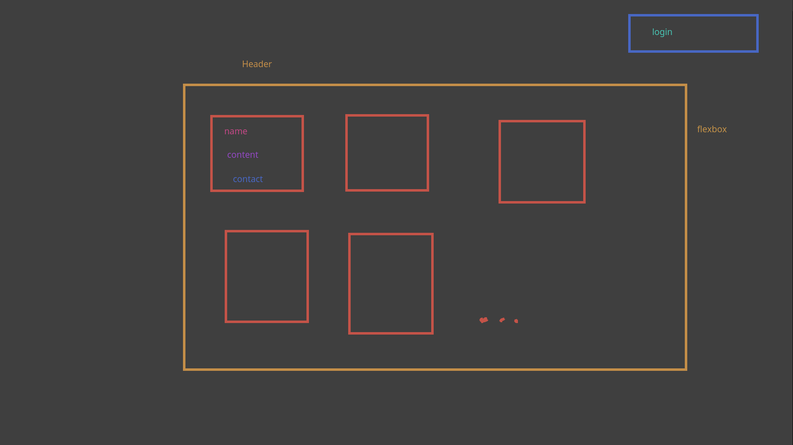

# BULLETIN BOARD
Multi-user bulletin board browser application where anyone can post once they make an account. This is a good idea

## WIREFRAME

## STEPS
1. basic html/css for each page
2. auth page
3. create post page and functionality
4. fetch post functionality
5. render/display post functionality

## HTML ELEMENTS
### on board page
- header with page title, login button, create button

### on login/signup page
- login form w/submit button
- signup form w/submit button

### on create page
- form for post details
    - title
    - content
    - contact (text entry)

## State
### board page
- `posts` - array containing posts loaded from database

## Events
### on login/signup page
- on click submit for login form:
    - log in
    - redirect to board page

- on click submit for signup form:
    - create account
    - log in
    - redirect to board page

### on board page
- on page load:
    - load posts, display

- on click login:
    - redirect to login/signup page

- on click create:
    - redirect to create post page

### on create post page:
- on page load:
    - if not logged in, redirect to login

- on click submit:
    - check for empty fields
    - submit info to db
    - return to board page

## Functions
### Render
- `renderBoardPost()`

### Display
- `displayPosts`

### Fetch
- `fetchPosts()`
- `createPost(title, content, contact)`
- `signUpUser`
- `signInUser`

### Other
